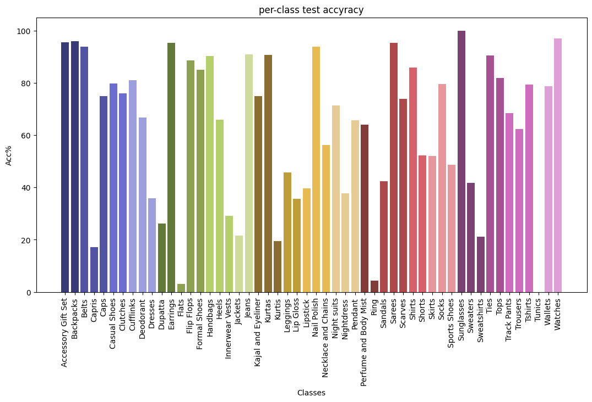

# **Image Classification with PyTorch: Adjustable MLP Layers and Neuron Counts**

This repository provides an end-to-end pipeline for building an image classification model using PyTorch. The project includes custom dataset handling, data preprocessing, training, validation, and evaluation of a Multi-Layer Perceptron (MLP) model. It also explores advanced training techniques like weight initialization, learning rate tuning, batch size optimization, momentum adjustment, and regularization.

## **Table of Contents**
- [Overview](#overview)
- [Dataset Structure](#dataset-structure)
- [Platform Recommendations](#platform-recommendations)
- [Requirements](#requirements)
- [Key Features](#key-features)
- [Usage](#usage)
- [Results](#results)
- [Future Enhancements](#future-enhancements)
- [Contributing](#contributing)

---

## **Overview**

This project demonstrates the implementation and evaluation of an image classification model using PyTorch. It focuses on training a Multi-Layer Perceptron (MLP) model on a dataset consisting of 52 distinct product categories. Each folder in the dataset represents a product category, containing images that are uniquely named.

Key practices covered:
- Weight initialization analysis
- Learning rate experimentation
- Batch size tuning
- Momentum evaluation
- Activation function comparisons
- Regularization techniques to prevent overfitting

---

## **Dataset Structure**

The dataset includes images of 52 product categories, provided in a zipped file. Each category corresponds to a folder containing images named `id.jpg` (where `id` is unique). Upon extraction, the structure is as follows:

```
/categorized_products/
    class_1/
        img1.jpg
        img2.jpg
        ...
    class_2/
        img1.jpg
        img2.jpg
        ...
    ...
```

**Dataset Class Distributions:**


---

## **Platform Recommendations**

For computationally intensive tasks like neural network training, GPU support is essential. It is recommended to use **Google Colab** or a similar platform to significantly reduce execution time.

---

## **Requirements**

Install the following Python libraries:

- `torch`
- `torchvision`
- `pandas`
- `numpy`
- `matplotlib`
- `Pillow`

---

## **Key Features**

1. **Custom Dataset Implementation**
   - Efficient data handling using PyTorch's `Dataset` and `DataLoader`.
   - Supports data augmentation and one-hot encoding.

2. **Flexible Model Architecture**
   - Customizable MLP with dynamic hidden layers and neurons.

3. **Visualization**
   - Visualize training/validation loss and accuracy trends.
   - Display per-class accuracy using bar plots.

4. **Advanced Training Practices**
   - Analyze weight initialization, learning rates, batch sizes, momentum, and regularization.

---

## **Usage**

### **1. Clone the Repository**
```bash
git clone https://github.com/your-username/repository-name.git
cd repository-name
```

### **2. Prepare the Dataset**
Download the dataset using:
```python
# Install gdown
%pip install -q --upgrade --no-cache-dir gdown

# Download the dataset
!gdown 1x0FwuF_3fbtoatMJOQBgzgebkjONx9_I
```

Alternatively, download it directly using the link below:
```python
import gdown

# Google Drive link
download_url = 'https://drive.google.com/uc?id=128gOPRGrrxz1Fyzl6FMq3Sdigx1VbOHq'
output_file = "products.zip"

# Download using gdown
gdown.download(download_url, output_file, quiet=False)
```

Ensure the dataset is structured as described in the [Dataset Structure](#dataset-structure) section.

### **3. Update Configuration**
- Update `train_df`, `valid_df`, and `test_df` to reference your dataset.
- Set `classes_list` to include the class names in your dataset.

### **4. Run the Notebook**
Run the notebook in Colab:


---

## **Results**

### **Metrics Provided**
- **Overall Accuracy**: Test accuracy percentage.
- **Per-Class Accuracy**: Visualized with bar plots.
- **Insights**: Performance metrics for varying weight initialization, learning rates, batch sizes, momentum, and regularization.

Example output for training an MLP with 2 hidden layers (11500 and 6500 neurons, respectively):

**Train & Validation Accuracy Plot:**


**Train & Validation Loss Plot:**

```
Test Accuracy: 74.7%
```

**Per-Class Accuracy Plot:**


---

## **Future Enhancements**

### **Weight Initialization**
- Evaluate results with all weights set to zero versus random initialization.
- Discuss optimal initialization strategies.

### **Learning Rate Analysis**
- Find the best learning rate for the network.
- Analyze network performance at high (e.g., 0.1) and low (e.g., 0.001) rates.
- Discuss trade-offs of extreme learning rates.

### **Batch Size Analysis**
- Compare batch sizes of 32 and 128.
- Evaluate the relationship between batch size and learning rate.

### **Momentum Analysis**
- Experiment with momentum values (0.5, 0.9, 0.98).
- Analyze their impact on training accuracy and stability.

### **Epoch Count Analysis**
- Train for 20 epochs and compare results.
- Discuss the diminishing returns of increased epochs.

### **Activation Functions**
- Replace ReLU with Tanh and Leaky ReLU.
- Compare their effects on accuracy and performance.

### **Regularization**
- Experiment with weight decay values (e.g., 0.01, 0.1).
- Compare outcomes with and without regularization.

---
